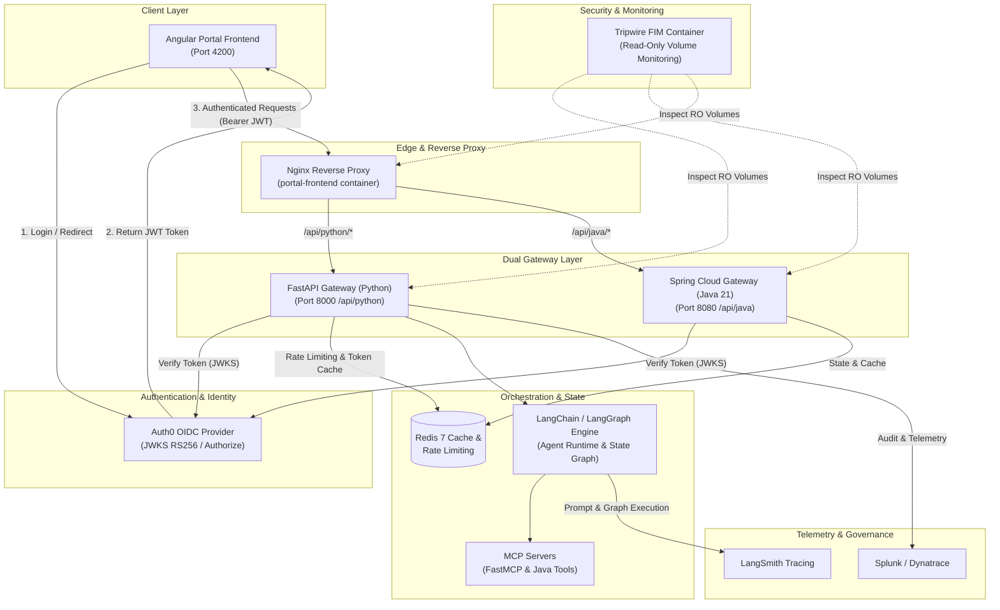

# AgentShield Enterprise

AgentShield is a multi-tenant AI gateway and agent platform for small businesses that need predictable LLM costs, secure tool access, reliable model routing, and measurable answer quality.

The project is designed as a learning and product-building system covering:

- Secure tenant onboarding, login, RBAC, API keys, and audit trails
- FastAPI gateway controls for authentication, rate limiting, budgets, caching, and cost analysis
- LangGraph orchestration with governed FastMCP tools
- Java 21 and Spring Boot microservices for high-throughput enterprise integrations
- Model routing, load balancing, fallback, and circuit breaking
- LLM-as-a-Judge evaluations for relevance, faithfulness, safety, and regression detection
- LangSmith tracing, Splunk dashboards, and Dynatrace APM
- VM and workload tuning using traffic, latency, token, and resource data
- Usage-based billing and subscription tiers

## Current Status

The initial service boundaries are scaffolded. Gateway, MCP, agent, evaluation, and observability implementations will be added incrementally behind these boundaries.

## Planned Repository Layout

```text
agent-shield/
├── config/
│   ├── settings.py
│   └── guardrails/
├── mcp_servers/
│   ├── __init__.py
│   └── tools_server.py
├── gateway/
│   ├── main.py
│   ├── auth.py
│   └── rate_limiter.py
├── agent_engine/
│   ├── graph.py
│   ├── mcp_client.py
│   └── state.py
├── evals/
│   └── judge.py
├── observability/
│   ├── splunk_exporter.py
│   └── dynatrace_tracer.py
├── java-services/
│   ├── gateway-java/
│   │   ├── pom.xml
│   │   └── src/main/java/com/agentshield/gateway/
│   └── mcp-server/
│       ├── pom.xml
│       └── src/main/java/com/agentshield/mcp/
├── portal-frontend/
│   ├── src/app/core/
│   ├── src/app/features/
│   ├── package.json
│   └── angular.json
├── .env.example
├── requirements.txt
├── docker-compose.yml
└── README.md
```

## Architecture Overview



The system ensures provider credentials remain behind the gateway. Tenants never receive upstream model keys, and MCP tools enforce authorization independently of the agent prompt.

## Local Prerequisites

- Python 3.12+
- Java 21+
- Maven 3.9+
- Docker Desktop with Compose
- Redis
- Optional accounts for LangSmith, Splunk, Dynatrace, Stripe, and an OIDC provider

## Configuration

Copy the example configuration into the local environment file:

```bash
cp .env.example .env
```

Fill in only the services you intend to run. Never commit `.env` or real credentials. The example file contains variable names and safe development defaults only.

## Intended Local Startup

Once the services are implemented, the expected development workflow will be:

```bash
docker compose up -d redis

# Python gateway
python -m uvicorn gateway.main:app --reload --port 8000

# Java MCP service
mvn -f java-services/mcp-server spring-boot:run

# Java edge gateway (port 8080)
mvn -f java-services/gateway-java spring-boot:run

# Angular control plane (port 4200)
cd portal-frontend && npm start
```

The exact commands may change as each service is added. Keep service-specific commands in their own README files when implementation starts.

## Local Compose Services

After setting `SPLUNK_PASSWORD` in `.env`, start the local stack with:

```bash
docker compose up --build
```

The local endpoints are:

- FastAPI gateway: `http://localhost:8000`
- Java gateway: `http://localhost:8080`
- Java MCP server: `http://localhost:8081`
- Splunk Web: `http://localhost:8001`
- Splunk HEC: `http://localhost:8088`
- Angular portal: `http://localhost:4200`

## Initial Delivery Phases

1. **Foundation:** repository layout, configuration, tenant model, FastAPI gateway, Redis rate limits, request IDs, and health checks.
2. **Reliable routing:** LiteLLM integration, token and dollar accounting, semantic caching, model fallback, load balancing, and circuit breakers.
3. **Agent runtime:** LangGraph state management, FastMCP discovery and invocation, tool-level RBAC, and execution limits.
4. **Safety and quality:** input/output guardrails, PII handling, prompt-injection defenses, LLM-as-a-Judge, and regression evals.
5. **Enterprise operations:** LangSmith traces, Splunk HEC events and dashboards, Dynatrace OpenTelemetry, alerts, and VM tuning experiments.
6. **Commercialization:** OIDC signup, Stripe subscriptions, usage metering, tenant administration, support workflows, and production hardening.

## Security Baseline

- Use OIDC/OAuth2 for human login and short-lived JWTs.
- Store service credentials in a secret manager in deployed environments.
- Hash or encrypt tenant API keys; do not store them in plaintext.
- Apply tenant scoping at every data and tool boundary.
- Validate MCP tool arguments with typed schemas and enforce per-tool permissions.
- Redact prompts, responses, tokens, and credentials before exporting telemetry.
- Add request IDs, audit events, budget checks, and idempotency handling to gateway requests.
- Treat model output as untrusted input.

## Development Principles

- Prefer reproducible local infrastructure through Docker Compose.
- Keep provider-specific code behind interfaces so routing and fallback remain testable.
- Test security failures, budget exhaustion, rate-limit behavior, fallback behavior, and tenant isolation before optimizing throughput.
- Use synthetic or scrubbed data for load tests and evaluation datasets.

## License

License selection is pending.
